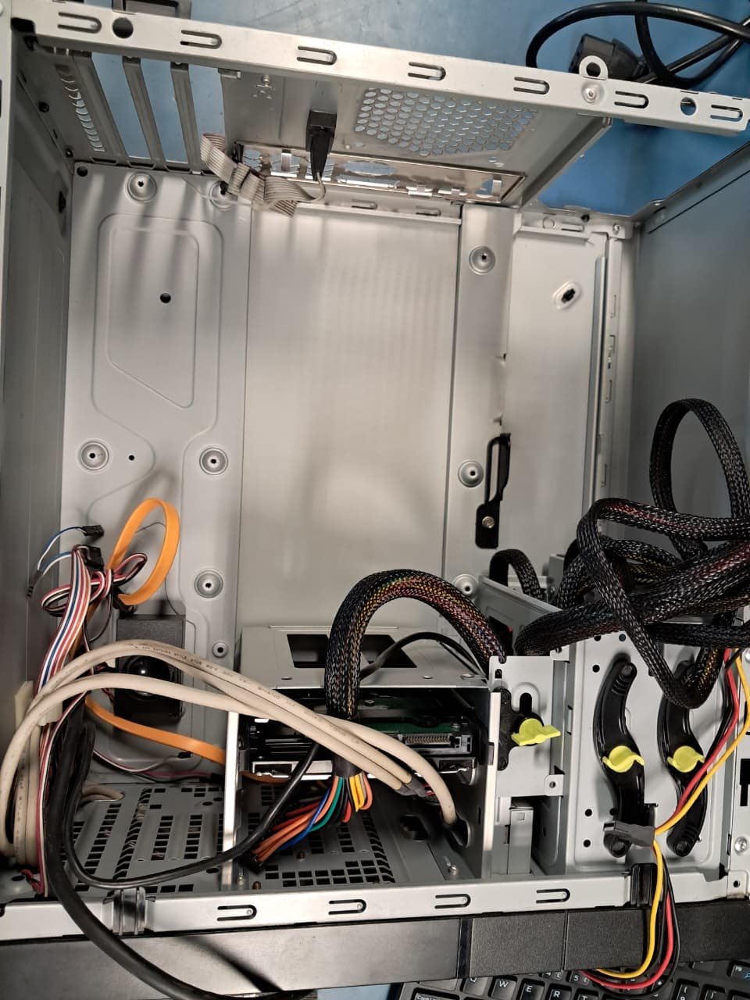

# Projeto: Montagem e Manutenção de Computadores

## Descrição

Este projeto documenta a execução prática de montagem, manutenção preventiva e testes de hardware em um computador desktop. O objetivo foi validar o funcionamento dos componentes, garantir a estabilidade do sistema e aplicar boas práticas de organização interna.

---

## Objetivos

* Realizar a montagem completa de um computador
* Executar limpeza física dos componentes
* Organizar o cabeamento interno (cable management)
* Validar o funcionamento do hardware por meio de testes de estresse
* Analisar a integridade do disco de armazenamento

---

## Configuração do Ambiente

**Hardware:**

* Processador: Intel Core i7-4770
* Memória RAM: 8 GB DDR3 1600 MHz
* Placa de vídeo: NVIDIA GeForce GT 740 (2 GB)
* Armazenamento: HD Seagate 1 TB (7200 RPM)
* Placa-mãe: Positivo POS-EIQ87CY (chipset Intel Q87)
* Fonte de alimentação: 400 W

**Software:**

* Sistema Operacional: Windows 10 Pro
* DirectX: Versão 12

---

## Procedimentos Executados

### 1. Limpeza de Hardware

Foi realizada a limpeza dos componentes internos com foco na remoção de poeira acumulada, especialmente em:

* Coolers e dissipadores
* Slots de memória e conectores
* Fonte de alimentação (externamente)

A limpeza contribui diretamente para a redução de temperatura e aumento da vida útil dos componentes.
!

---

### 2. Montagem do Sistema

A montagem seguiu as etapas padrão:

* Instalação do processador na placa-mãe
* Aplicação de pasta térmica e fixação do cooler
* Instalação dos módulos de memória RAM
* Fixação da placa-mãe no gabinete
* Instalação do disco rígido (HD)
* Conexão dos cabos de energia (ATX e CPU)
* Conexão dos cabos de dados (SATA)

---

### 3. Organização de Cabos

Foi realizado o gerenciamento de cabos com os seguintes objetivos:

* Melhorar o fluxo de ar interno
* Facilitar futuras manutenções
* Reduzir o risco de superaquecimento

---

## Testes e Validação

### Teste de Estresse de GPU

Ferramenta utilizada: FurMark

* Carga de uso: 100%
* Temperatura máxima observada: aproximadamente 75 °C
* Resultado: funcionamento estável durante o teste

---

### Teste de Integridade do Disco

Ferramenta utilizada: CrystalDiskInfo

* Status de saúde: Saudável
* Temperatura média: 40 °C
* Horas de uso: aproximadamente 11.000 horas
* Observação: nenhum erro crítico identificado via S.M.A.R.T.

---

### Verificação Geral do Sistema

* Sistema operacional inicializado corretamente
* Drivers instalados e funcionando
* Sem falhas aparentes após montagem

---

## Resultados

O sistema apresentou funcionamento estável após a montagem e manutenção, com temperaturas dentro dos padrões esperados e todos os componentes operando corretamente.

---

